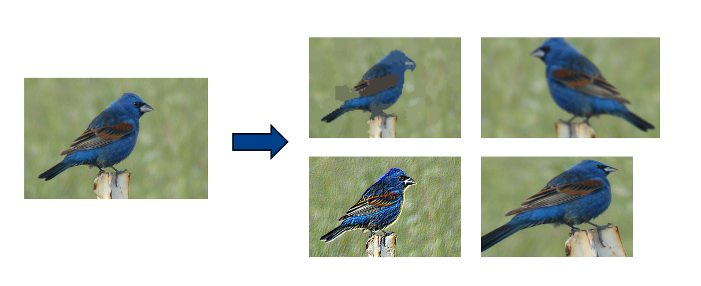
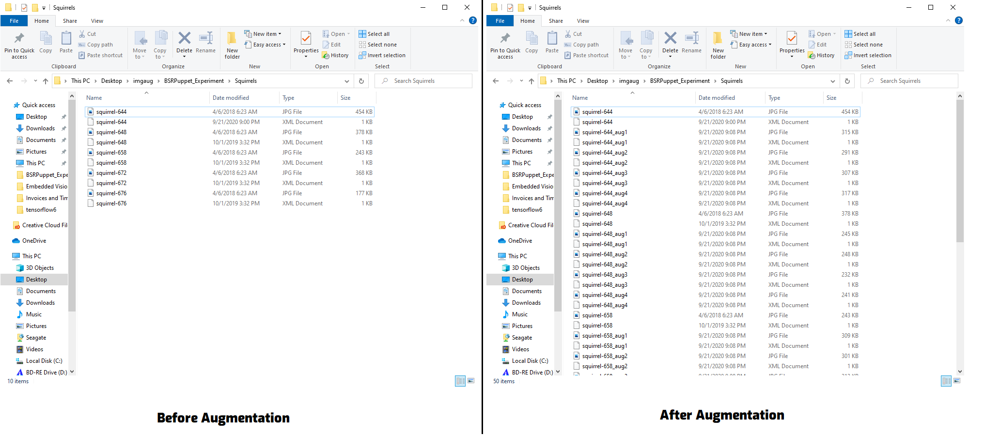
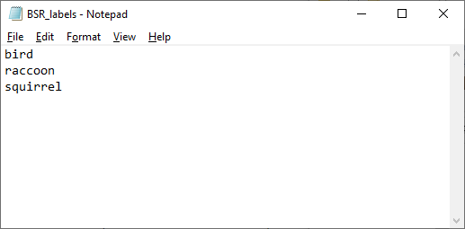

# Image-Augmentation-Examples-for-Machine-Learning

<p align="center">
   
</p>

The code in this repository shows how to use [imgaug](https://github.com/aleju/imgaug) to create thousands of augmented images for training machine learning models. Image augmentation is a quick way to improve accuracy for an image classification or object detection model without having to manually acquire more training images.

This repository is provided as a reference and example for my talk at the Embedded Vision Summit 2020 conference, [Practical Image Data Augmentation Methods for Training Deep Learning Object Detection Models](https://embeddedvisionsummit.com/2020/session/practical-image-data-augmentation-methods-for-training-deep-learning-object-detection-models/).


## Requirements

- Python 3.4+
- OpenCV v4.1.0+
- numpy v1.16.4+
- imgaug (`pip install imgaug` or `conda install imgaug` if using an Anaconda environment)


## Usage
### Basic Augmentation for Image Classification Models


### Augmentation with Keypoints or Bounding Boxes for Object Detection Models
The augment_with_KPs.py script will go through a folder of images and create a specified number of augmented images from each original image. Each image must have a corresponding annotation data file in [Pascal VOC format](https://gist.github.com/Prasad9/30900b0ef1375cc7385f4d85135fdb44). A new annotation file will also be created for each augmented image.

There are several input arguments:

* `--imgdir` specifies the name of the folder with the images to augment

* `--imgext` specifies the extension of the images to augment (default is .JPG)

* `--labels` specifies the name of the label file that contains the names of each class for your model. The label file must be a text file listing the classes, with each class seperated by a newline. See the image below for an example label file for a bird, squirrel, and raccoon detection model.

* `--numaugs` specifies the number of augmented images to create from each original image. (default is 5)

* `--debug` should only be used for test purposes. It causes each augmented image to be dispalyed to preview what the augmentations will look like. (default is False)

Here's an example for how to run the script. In this example, I am pointing the script at a folder called "Squirrels" and creating 4 augmented images from each original image.

```
python augment_with_KPs.py --imgdir=Squirrels --labels=BSR_labels.txt --numaugs=4
```

Here's a picture of the image folder before and after running augmentation.

<p align="center">
   
</p>


As another example, here is how to point the script at a folder called "Test", indicate that the image extension is .png, create 5 augmented images per original image, and display every augmented image as they are being augmented.

```
python augment_with_KPs.py --imgdir=Test --imgext=.png --labels=BSR_labels.txt --debug=True
```

Here is an example of a label file.

<p align="left">
   
</p>


